# LURE (Command-Line)
***********************


### Overview
***********************
LURE is a pipeline for designing probes targeting a particular region for Hybrid Capture Hi-C (Hi-C^2^).

The user supplies a genome (.fasta format), genomic coordinates, a restriction enzyme, and the desired number of probes and LURE preferentially selects the highest quality 120 base pair sequences.

#### Dependencies
* [Genome.fasta](https://genome.ucsc.edu/cgi-bin/hgGateway)
* [Bedtools](http://bedtools.readthedocs.io/en/latest/)
* [R (version 3.3.2)](https://www.r-project.org/)
* [HiCUP (Hi-C User Pipeline)](https://www.bioinformatics.babraham.ac.uk/projects/hicup/) and its dependencies.
* [GNU Parallel](https://www.gnu.org/software/parallel/)
* UNIX-based operating system

### Quick Start
**********************
1. Clone git repository:
```{bash eval=F}
git clone https://github.com/PhanstielLab/lure.git
```

2. Ensure that you have downloaded the proper [dependencies](#dependencies) and added them to your PATH.

3. Run the lure/shell/lure.sh script substituting in your desired values as shown:
```{bash eval=F}
./lure/shell/lure.sh -c chr8 -b 133000000 -e 135000000 -r '^GATC,MobI' -g /path/to/genome.fasta -n 1000 -l 120 -o temp/
```

4. LURE will echo your settings and ask to continue:
```{text eval=F}
Genome:  /path/to/genome.fasta
Chromosome:  chr8
Start:  133000000
Stop:  135000000
Restriction Enzyme:  ^GATC,MobI
Number of probes:  1000
Probe Length:  120
Output folder:  temp/

Run these settings? [Y/n]
```

5. Messages will be written to <code>stdout</code> showing progress and displaying output:
```{text eval=F}
HiCUP Digester (version 0.6.1)
index file /tmp/lure/roi.fasta.fai not found, generating...
Constructing Probes .....
100% 2:0=0s ./lure/shell/create_reverse.sh                                                                           
Selecting Probes ....
100% 6:0=0s ./lure/shell/select_reverse_3.sh                                                                         
Optimizing Probes ...
Output:
```

### Details
**********************
#### Implementation
LURE is written in BASH and R. It utilizes several command line tools (see Dependencies section) to identify and fragment the region of interest by restriction site (HiCUP), extract genomic fragments (Bedtools), and assess potential probes in parallel (GNU Parallel). The diagram below outlines LURE's workflow:



#### Selection Criteria
Criteria for selecting probes were modeled after Sanborn et. al. (2015) where they outline their Hi-C^2^ method. 

Briefly, potential probes were identified upstream and downstream of each restriction site. All potential probes were scored for repetitive bases, GC content, and distance from restriction site. Each probe was assigned a "Pass Number" (0-3) for overall quality according to the scheme below:

Pass Number | Distance from Restriction Site | Repetitive Bases | GC Content
------------|--------------------------------|------------------|------------
0 (Highest Quality) | ≤ 80 bp | < 10 | 50 - 60% 
1  | ≤ 80 bp | < 10 | 40 - 70% 
2  | ≤ 110 bp |  10 - 20 | 40 - 70% 
3 (Lowest Quality) | ≤ 110 bp | 20 - 25 | 25 - 80% 

Selection criteria relax as pass number increases, making the highest quality probes (passing the most restrictive criteria) pass 0 and lowest quality probes (passing the least strict criteria) pass 3.
